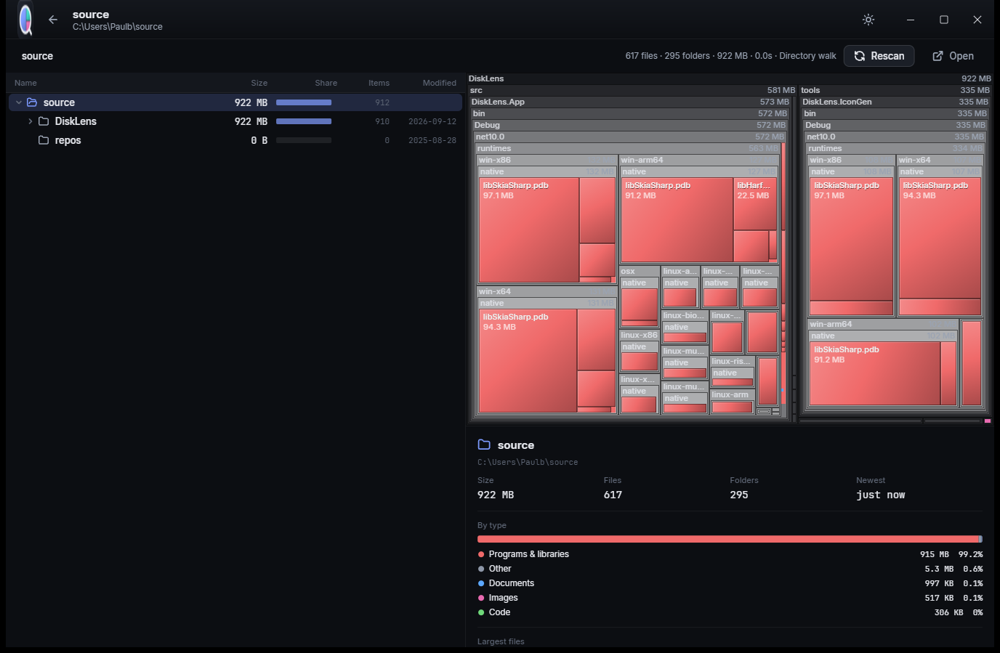

<p align="center"></p>

# DiskLens

[](https://github.com/NiceAustrian/DiskLens/actions/workflows/ci.yml)
[](LICENSE)

Disk space analyser in the spirit of TreeSize / WizTree / WinDirStat – C# on .NET 10, with its own
GPU-rendered UI (SkiaSharp + Silk.NET, no UI framework), cross-platform, and an NTFS MFT reader
that scans a 1.5 TB drive in ~5 seconds.



## Features

- **Tree view** with size, share bar, item count and modification date; keyboard navigation.
- **Nested treemap** (squarified) with labelled folder frames, type colouring, hover/select sync,
  zoom by double-click, breadcrumb.
- **Details panel**: headline numbers, breakdown by file type, largest files.
- **Live updates** while the scan runs.
- **Scanners are plug-ins** chosen per target:
  - `ntfs-mft` – reads the Master File Table directly (Windows, administrator). ~5 s for millions
    of files.
  - `generic-walk` – portable parallel directory walk on top of `FileSystemEnumerator`. Works
    everywhere; ~15 s for the same drive.
- Context menu: open in file manager, copy path, zoom, move to Recycle Bin (Windows) / delete.
- Custom title bar on Windows (drag, Snap Layouts, double-click maximise all still work), dark and
  light theme, DPI aware, idle at 0 % CPU.

## Build & run

```
dotnet run --project src/DiskLens.App                 # start with the drive picker
dotnet run --project src/DiskLens.App -- C:\Users     # scan a folder immediately
dotnet run --project src/DiskLens.App -- --light      # light theme
dotnet run --project src/DiskLens.App -- --bench C:\ --scanner ntfs-mft   # headless benchmark
dotnet test
```

Requires the .NET 10 SDK. On Linux you need an OpenGL 3.3 capable driver (Mesa is fine); native
SkiaSharp binaries for Linux are pulled in via NuGet.

## Architecture

```
src/
  DiskLens.Core              model, scanner abstractions, treemap layout, statistics – no UI, no platform
  DiskLens.Scanners.Generic  portable walk scanner + DriveInfo volume provider
  DiskLens.Scanners.Windows  NTFS MFT scanner, elevation, Recycle Bin
  DiskLens.Scanners.Posix    (placeholder for /proc/mounts, statx, ...)
  DiskLens.UI                the toolkit: window host, element tree, flex layout, widgets, animation
  DiskLens.App               composition root (Generic Host + DI), shell, views, treemap/tree controls
tests/DiskLens.Tests
tools/DiskLens.IconGen       renders the app icon (PNG + ICO) from code
```

### Model

`FsTree` is a struct-of-arrays: one `ChunkedArray<T>` per column (parent, name, size, flags, …).
Chunks never move, so the UI can read the tree while a scanner keeps appending; aggregates
(total size, counts) are propagated up with interlocked adds as entries arrive. 3.6 M nodes take
~850 MB, dominated by name strings.

### Scanners

`IFileSystemScanner.ProbeAsync` tells the registry how well a scanner fits a target
(`NotApplicable` / `Fallback` / `Supported` / `Preferred`, plus `RequiresElevation`); the best
applicable one wins. Scanners write into an `IScanSink`, which owns node ids – they never touch the
tree directly. Adding a scanner (SMB, restic, S3, …) is one class plus a DI registration.

### UI toolkit

Retained element tree with absolute bounds, two-pass flex layout, per-frame animation ticks, and
Skia drawing straight into the GL framebuffer. Widgets: labels, buttons, scroll view, virtual rows,
text box, progress bar, popups. Fonts: Inter and JetBrains Mono (embedded, OFL). Icons: Lucide
paths (ISC).

## Licence

MIT for the code. Fonts under the SIL Open Font License, icons under ISC (see `src/DiskLens.UI/Assets`).
